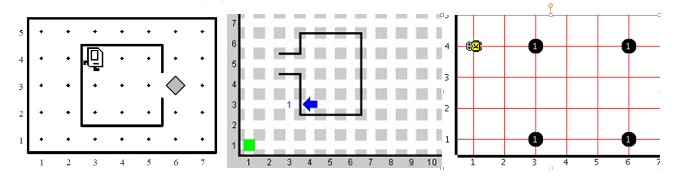

2. 简介
========

2.1 目标
---------
- 学习关于Karel语言的基本知识和历史.
- 学习Karel与其它语言的区别.
- 学习这个课程能给你带来什么技能.

2.2 简史
----------
教育编程语言Karel the Robot(卡雷尔机器人)是由Richard E. Pattis在他1981年出版的书Karel The Robot: A Gentle Introduction to the Art of Programming中介绍的. Pattis首先在斯坦福大学的课程中使用这个语言, 而今Karel已经在世界无数的学校中使用. 这个语言是以一个捷克作家Karel Capek命名, 他在其1921年的科幻剧R.U.R.(Rossum’s Universal Robots)中发明了“机器人”这个词. 
:ref:`my-figure` 展示了可以在网上下载的此语言的各种实现: 

.. _my-figure:

   
   图1. Karel的各种实现
	
原始的Karel语言受到Pascal语言的强烈影, Pascal是一种1980年代流行的语言. 由于Pascal如今已经不再被采用, 我们更新语言并且将语法调整为与Python相近, Python是一种高级动态编程语言. 我们的调整使得语言更加容易使用. 为了展示,对比一下原始的Karel程序:

::

    BEGINNING-OF-PROGRAM
		DEFINE turnright AS
		BEGIN
			turnleft
			turnleft
			turnleft
		END
		BEGINNING-OF-EXECUTION
			ITERATE 3 TIMES	
			BEGIN
				turnright
				move
			END
			turnoff
		END-OF-EXECUTION
	END-OF-PROGRAM

与Computing-works中Karel等价的代码片段

::

	def turnright
		repeat 3
			left
	repeat 3
		turnright
		go

事实上,Computing-works的Karel有一个右转的内联命令right, 所以上面的程序可以由下面3行书写:

::

	repeat 3
		right
		go

2.3 Karel是谁
-----------------
Karel是住在迷宫中的小机器人, 它喜欢收集宝石. 它被制造为在记忆中只存在5个简单的命令:

- go ... 向前走一步
- get ... 从地上捡起一个宝石
- left ... 转向左
- right ... 转向右
- put ... 向地上放下一个宝石

Karel还具有5个内置的探测器, 使他可以检测他周围的情况:

- wall ... 帮助机器人探测它正前方的墙
- gem... 帮助机器人探测它下面的宝石
- tray... 帮助机器人探测它下面的空托盘
- north ... 帮助机器人探测它是否面向北
- home ... 帮助机器人探测它是否回到家
- empty ... 帮助机器人探测它的宝石包是否空

2.4 你在本课程中能学到什么
----------------------------

计算机编程技能在当今非常被看中, 而且在将来会更加被看中. Karel是初学者的完美语言. 它将教会你如何设计算法, 并且写出可以运行的计算器程序而不必纠缠于其他主流编程语言的技术复杂性. 多亏了它的简单性, 你可以用Karel快速起步, 并且准备好了时刻切换到其他语言. Computing-works另提供了一个Python的编程课程.

2.5 Karel是一种玩具语言吗
----------------------------

绝对不是! 尽管它看上去俏皮的外观, Karel具有现代过程式编程的所有核心特点. 技术上讲, 它是完全图灵机. 事实上, 你在本教材上遇到的算法复杂度将从非常简单跨越到非常难.

2.6 Karel与其它编程语言的区别
-------------------------------

Karel与其它主流过程式程序语言, 如Python, C, C++, Java或 Fortran, 在概念上的最大差异在于这个机器人不需要了解数学. 这是因为理解如何设计伟大的算法并将它们翻译为有效的计算机程序并不需要数学.

