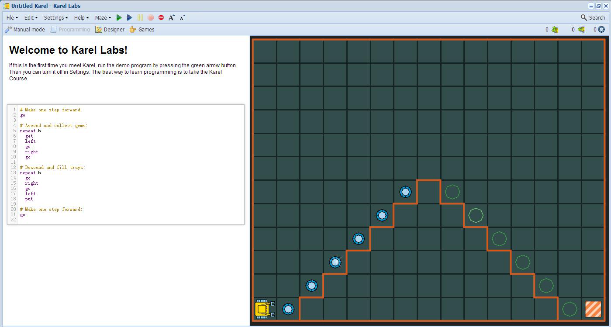

3. 启动 Karel
================

3.1 目标
---------

- 学习启动Karel 与操作图形应用
- 了解Karel具有很多模式以及他们的区别

启动Karel的最简单方法是双击桌面上的程序图标, 然后在菜单中选择Karel. 这将如 :ref:`p3-figure-01` 启动一个应用程序:

.. _p3-figure-01:

   图1 以编程模式1启动演示程序

从编程模式1可以切换到编程模式2,3, 手工模式, 设计师和游戏模式. 这些模式将在节3.3中讨论.

3.2 主菜单
-----------
应用程序窗口在顶部包含主菜单,左侧是工作区域,右侧是迷宫,底部是状态棒. 此菜单非常直观, 所以我们只选择一些功能加以说明. 在文件菜单中:

- 在学习材料菜单下面你可以找到本教材, 互动练习; 教师可以得到求解程序
- 新建, 将创建一个新的Karel文件
- 打开, 将打开一个已存在的Karel文件
- 保存, 将把你的文件保存在Computing-works帐户中
- 发布到网络, 将为你的项目创建一个静态HTML链接

迷宫菜单方便了对迷宫的操作, 包括创建一个新的随机迷宫, 复制已有的迷宫, 恢复迷宫到它保存的版本, 以及保存和移除迷宫. 编辑菜单用来进行代码单元和HTML单元的操作(将在 :doc:`第七部分<p07>` 中讨论). 设置菜单可以改变Karel的行走速度,调整音乐效果等.
绿色和红色的按钮分别被用来启动和停止程序, 它们右边的两个按钮用来调整字体的大小, 最右侧的三重图标分别用来显示操作计数, 步进计数和宝石计数.

3.3 Karel模式
--------------
可以用6种方式操作Karel:

- 手工模式. 用鼠标和5个按钮(走,拿,左,右,放)控制机器人, 当心不要摔坏.
- 编程模式1. 程序用6个指令控制(走,拿,左,右,放,重复). 重复指令将以指定的次数按顺序重复5种基本指令, 或者重复另一个重复指令.
- 编程模式2. 基于编程模式1, 程序可以包含条件, 条件循环和个性化命令.
- 编程模式3. 此模式引入变量, 列表, 随机决定, 基本整数运算和可以返回值的函数. Karel携带有GPS设备可以感知在迷宫中位置.
- 设计师. 允许用户创建个性化的迷宫.
- 游戏模式. 使创建和玩游戏成为可能.
