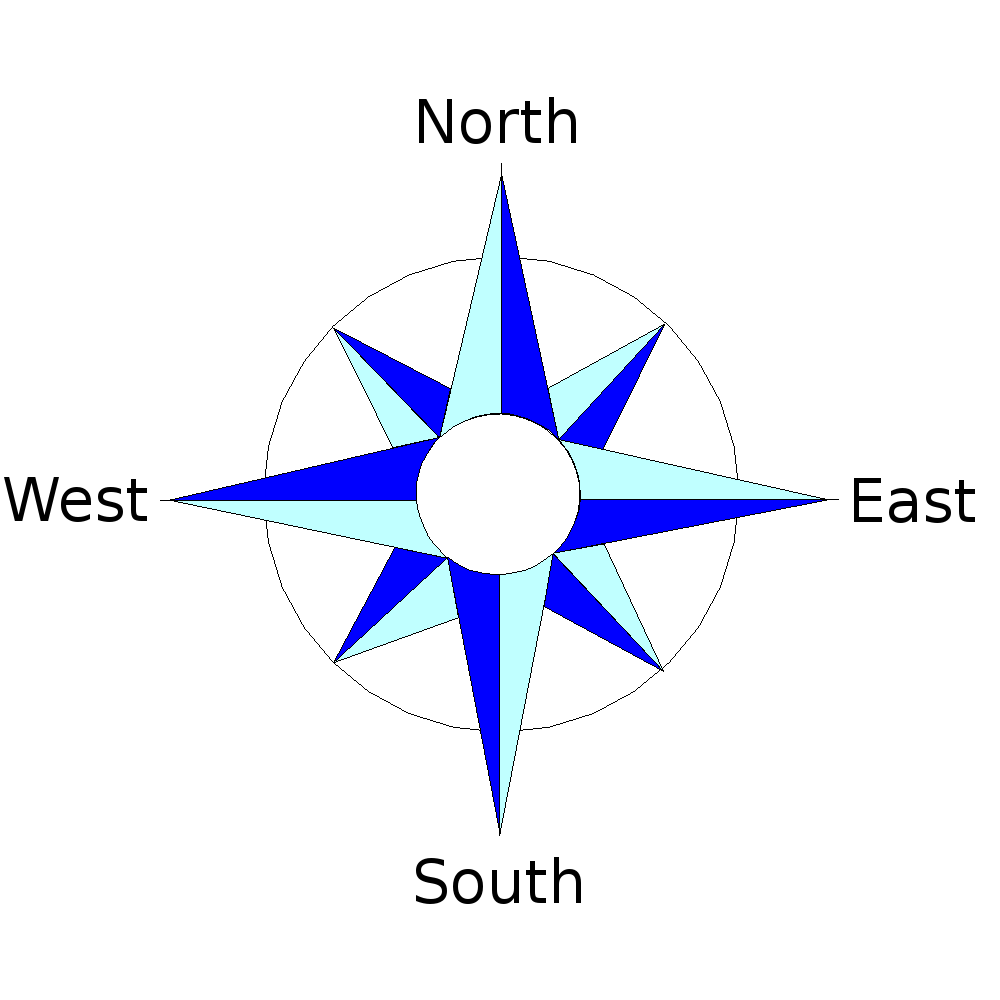
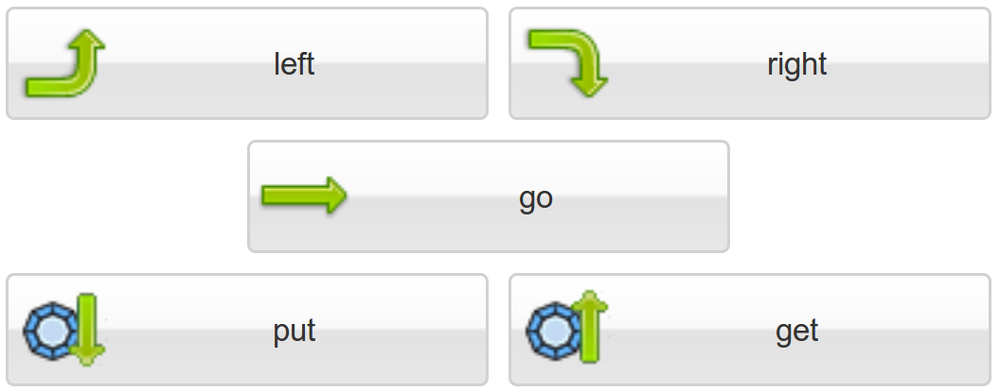
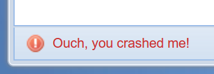
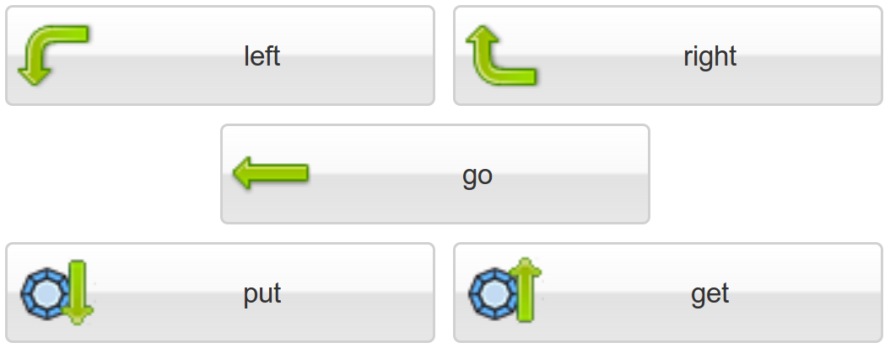

4. 热身
============

4.1 目标
---------

- 复习罗盘上的方向
- 学习通过点击按钮指引机器人
- 了解错误消息
- 了解基于机器人的左右概念
- 学习提前规划你的行动

4.2 罗盘
----------

:ref:`p4-figure-01` 展示了罗盘的4个方向: 北,南,西,东

.. _p4-figure-01:

   图1. 罗盘的4个方向

4.3 控制按钮
------------

在启动Karel之后,切换到手工模式, 如下图所示的5个按钮将显示在左侧面板:

   图2 手工模式下的按钮(机器人向东)

点击左转按钮将使机器人向左转90度, 点击右转按钮将使机器人向右转90度, 点击这两个按钮不会产生错误, 但点击其它按钮有可能产生错误.

4.4 错误消息
-------------
点击走会使机器人向前走一步, 如果他撞到了墙就会抛出一条错误消息:

   图3 错误消息在底部左下角显示

除了可以拾起一枚宝石，他还可以从宝石袋中取一枚宝石放到地上. 如果他的宝石袋是空的, 他同样会抛出一条错误消息. 显示他宝石袋中宝石数量的指示器在窗口的右上方. 最后, 点击”取”将从地上拾起一枚宝石, 如果没有宝石将显示错误信息.

4.5 Robot视角
--------------
当机器人转向, 按钮上的箭头会根据他的朝向自动调整. 如 :ref:`p4-figure-04` 所示:

.. _p4-figure-04:

   图4.在手工模式下的按钮(机器人向西)

