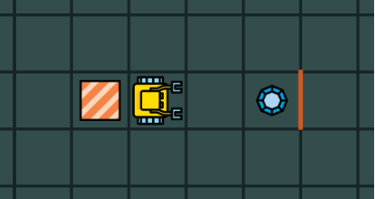

5. 编程
============

5.1 目标
---------

- 写你第一个计算机程序
- 了解算法和程序的区别
- 了解逻辑错误与句法错误的不同
- 了解调试是计算机编程不可分的一部分

5.2 输入命令
-------------

命令将输入左边面板中的代码元包. 在编程模式中, 我们可以使用命令left, right, go, get, put, repeat等还有许多. 一条或多条命令组成计算机程序或代码. 这里可以记住两条简单的规则:

1. 总是在每行输入一个命令
2. 缩进是有影响的 --- 每个命令在行头开始

遵循这些规则有助于使你的代码干净,可读.

5.3 算法
-----------

Karel总是严格执行你的命令.没有例外.如果机器人做错了什么,比如撞墙了,那很有可能不是它的错误而是你的错误. 你的算法是错的.

::

		算法是完成指定任务的一系列逻辑步骤.

算法是用人类通用语言写的.考虑以下迷宫,Karel的任务是捡起宝石并返回它的家.

   图1.拾起宝石并回家

这个任务可以用以下算法解决:

::

	向前走两步
	拾起宝石
	转回身
	向前走三步

下一节我们将此算法转化为计算机程序.

5.4 程序
-----------

::
		
		将算法翻译成特定的计算机语言形成程序.

在我们的课程里使用Karel语言. 对应于上述算法的程序是

::
	
	go
	go
	get
	left
	left
	go
	go
	go

通常将算法翻译为程序有多种方法.比如上述算法同样可以翻译为

::

	go
	go
	right
	get
	right
	go
	go
	go

5.5 逻辑和句法错误
--------------------

::

	算法中的错误是逻辑错误.

让我们回到上面的问题,考虑以下算法

::

	向前走三步
	拾起宝石
	转身
	向前走三步

这将使机器人撞毁! 我们做出了错误的计划 --- 逻辑错误.

::

	程序中,诸如拼错命令,将"10"写成"1O",或者忘记缩进则属于句法错误.

找到下面程序的三处错误!

::

	go
	go
	got
	rlght
	night
	go
	go
	go

上述任何一种错误都属于 *bugs*,取消它们的过程叫做调试(*debugging*). 根据我们准备算法和写程序的认真程度,调试时间可以很长或者很短.
刚刚编好的程序完全正确并不常见.

::

	通常逻辑错误比句法错误更难被发现.因此,在开始编程前,要确保设计好的算法并且全面地考虑问题.

当我们的程序出现句法错误,机器人会输出一个错误消息并且什么也不做.
当我们的程序出现逻辑错误,很多事情都会发生:机器人会执行程序尽管并不能完成任务.或者它有可能触发错误消息并且停止程序.

