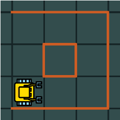
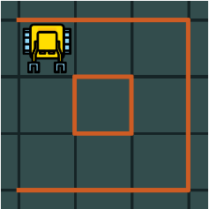
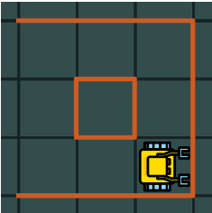
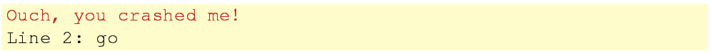
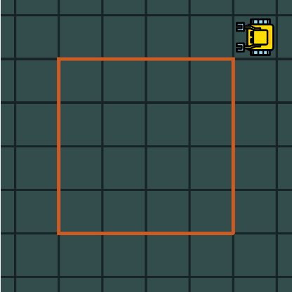
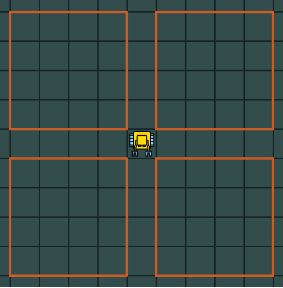

6. 计数循环
============

6.1 目标
---------

- 学会使机器人重复做某事若干次
- 学习循环体 *loop* 的含义和缩进的影响

::

	计数循环出现在所有过程性编程语言中,它允许我们以指定的次数重复一些命令或者一串命令.

在Karel中,计数循环使用 *repeat* 命令.其它语言使用不同的命令,但思想都是一样的.

6.2 精巧的走路方式
-------------------

看一下这个例子,Karel需要拾起一个宝石并返回它的家(方框).

.. figure:: _static/6_01.png
   :align: center
   :width: 80%

   图1.重复某一行为若干次

当然我们可以输入

::

	go
	go
	go
	go
	go
	go
	go
	go
	go
	go
	get
	left
	left
	go
	go
	go
	go
	go
	go
	go
	go
	go
	go
	go

但是这样的程序看上去很糟糕!换句话说,有更优雅的方式实现同一目标,即通过告诉Karel用repeat重复循环go命令10次,拿宝石,转身,再用repeat重复循环go命令11次:

::

	repeat 10
	  go
	get
	repeat 2
	  left
	repeat 11
	  go

如此这般就可以了.也许你奇怪为什么有些命令缩进了?下面我们来解释一下.

6.3 循环体
------------

::

	需要循环的命令集被叫做循环体.在Karel中,循环体通过缩进定义.
	这与Python是一样的.一些其它语言用其它方式,比如C/C++用花括号.

在上面的程序中,每个循环体只有一条命令,但是如果有多条命令,它们都应该被缩进.在Karel中,你可以选择2空格或4空格缩进.前者使代码看起来更紧凑,后者更容易阅读.

6.4 缩进错误
--------------

错误的缩进会改变循环体,并导致整个程序出现意外.举例,假设下图所示迷宫.Karel的任务是沿着墙走并停在左上角,面朝南.

   图2.Karel沿着障碍走

这可以用以下4行代码实现:

 ::

 	repeat 3
 	  go
 	  go
 	  left

执行完上述代码后机器人的位置如下图:

   图3.执行完程序Karel的位置

现在我们假设最后一条命令没有被缩进:

::

	repeat 3
 	  go
 	  go
 	left

现在相当于告知机器人向前走6步再左转 --- 这将使它撞毁在墙上!

   图4.错误缩进导致Karel撞墙

错误消息将提示你问题发生在代码何处:

6.5 套嵌循环
-------------

在上面的程序中,go命令写在了连续的两行.这没有问题,因为如果改为repeat仍然需要两行.但考虑如下情形,Karel需要绕着这个块走一圈再回到原点.

   图6.绕大块走一圈

在repeat中连续写5行go命令就显得不合适了 --- 程序看起来会很长.下面的代码就更简洁:

::

	repeat 4
	  repeat 5
	    go
	  left

::

	当一个循环中包含另一个循环,我们称之为循环套嵌.注意缩进规则适用于每个循环.

6.6 沿四方块行走
-----------------

让我们看最后一个例子:Karel站在两条路的交叉口,周围有4个块,如下图所示.Karel的任务是绕第一个块一圈回到交叉点,再绕第二个,以此类推,直到绕完4个块并回到原点.

   图7.站在交叉口

可以用以下代码完成任务:

::

	repeat 4
	  repeat 4
	    repeat 5
	      go
	    left
	  right

不妨花些时间建造这个迷宫并运行此程序,值得这个时间.
