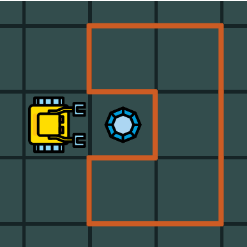
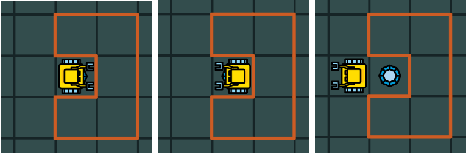
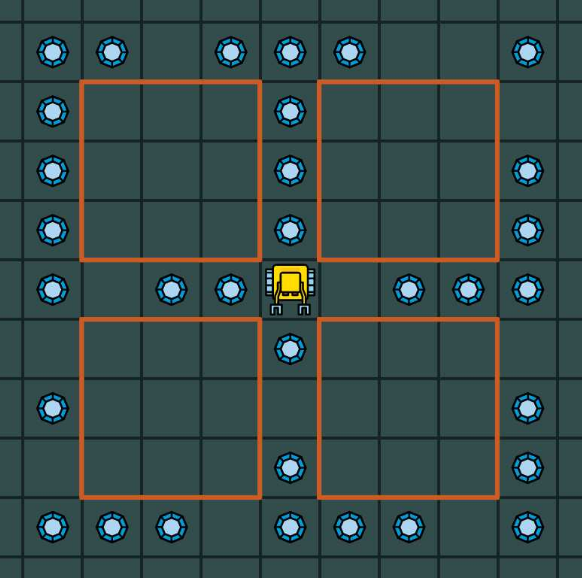
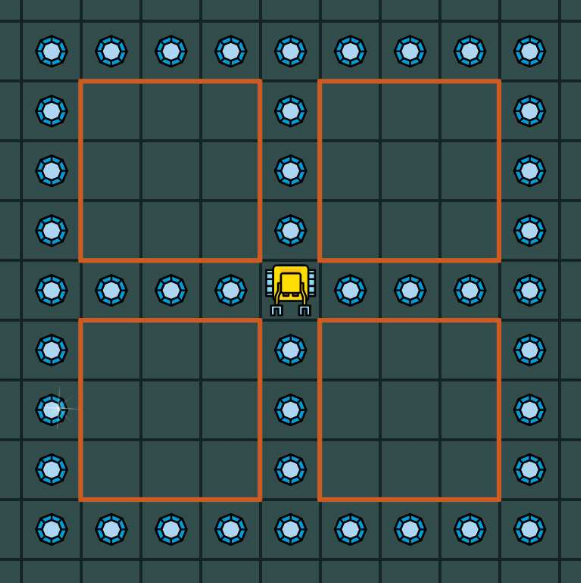
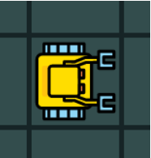

8. 条件
=========

8.1 目标
---------

- 理解编程中条件判断的作用
- 学会利用Karel的感知器结合条件判断来帮助机器人检查它的环境并做出响应.

条件判断出现在所有程序语言中.目的是当程序运行时做出判断决定,处理各种各样的未知情况.在Karel中,条件被用来检测它周围的环境,通过wall,gem,tray,empty,north和home命令.

8.2 wall感知器
---------------

wall感知器帮助机器人判断在它前面是否有墙.
简单程序"Careful step"
可以说明wall感知器的使用方法:如果前面有墙转回身否则向前走.注意#号后面是注释,它并不是程序的一部分.

::

	# Program "Careful step".
	if wall
	  repeat 2
	    left
	else
	  go

考虑Karel如下图所示站在宝石前

   图1.Karel的初始位置

我们点击绿色按钮运行上面程序3次,下图显示了每一次运行后Karel的位置:

   图2.每次运行后Karel的位置

8.3 关键字not
--------------
Karel在条件判断中使用not关键字.例如上述程序可以重新写为:

::

	# Program "Careful step".
	if not wall
	  go
	else
	  repeat 2
	    left

8.4 gem感知器
--------------
gem感知器使得Karel可以探测在它正下方的宝石.注意宝石必须与机器人在同一方块,因为它不能看见四周的宝石.重新考虑以下问题:

   图3.Karel的初始位置,与之前相同

让我们扩展程序"Careful step",使得Karel能够捡起沿途的宝石.

::

	# Program "Careful step II".
	if gem
	  get
	if wall
	  repeat 2
	    left
	else
	  go

每次运行"Careful step II"后Karel的位置如下图所示:

.. figure:: _static/8_03.png
   :align: center
   :width: 100%

   图4.每次运行后Karel的位置

8.5 tray感知器
--------------

tray感知器使得Karel可以探测在它正下方的空托盘.放有宝石的托盘不能被探测.
让我们考虑如下情形,家方块在Karel前方10步远处.宝石和托盘的位置是随机的,但Karel事先知道宝石肯定在托盘前面.它的任务是找到宝石并把它放在托盘上,然后进入家方块.

   图4.Karel的任务是找到宝石并把它放到托盘上

此程序如下:

::

	repeat 10
	　go
	　if gem
	    get
	  if tray
	    put

8.6 修理人行道
----------------
empty感知器使得机器人可以检查它的包是不是空的,或者结合not关键词判断是否包里至少有一枚宝石.假设Karel有四个房子,人行道环绕它们,如下图所示. 冬季过后部分人行道坏了,有一些砖(宝石代表)丢了.Karel的袋子里有不知确切数量的砖.写一个程序帮它修理人行道.

你的程序不应抛出任何错误即便它用完了袋子里的所有砖(宝石).

   图5.Karel正在修理人行道

首先我们可以根据 :doc:`第六节<p06>` 中编过的程序修改得到:

::
		
	repeat 4
	　repeat 4
	    repeat 4
	      go
	    left
	  right

以上程序不会使Karel完成任何修理工作,仅仅是沿着人行道走并返回初始位置.要想修理人行道,我们需要在go命令前插入其他条件判断语句.

::

	repeat 4
	  repeat 4
	    repeat 4
	      if not gem
	        put
	      go
	    left
	  right

难道这样的程序就完美了吗? NO! 如果Karel兜里的宝石比需要维修的宝石少,程序就会停止并发出错误消息.所以,我们需要在put之前检查empty感知器.最终程序如下:

::

	repeat 4
	  repeat 4
	    repeat 4
	      if not gem
	        if not empty
	          put
	      go
	    left
	  right

完工!　下图展示了经过维修的人行道.在运行程序前,我们向Karel的兜里放了15个宝石(通过设计模式).

   图６.运行程序后,人行道被修复了

8.7 使robot面朝任意方向
-------------------------

north感知器不仅可以用来检测机器人的朝向是否向北,还可以使它朝向任何方向.为此,我们先使它朝向北,因为这是我们唯一可以确认的方向.　让我们写一个程序使Karel朝向南,无论它起初面向何方!

   图7.Karel面向任意方向

此程序基于Karel起初可能面向任一方向的事实,最多转三次就可以使它面向北:

::

	# First turn North:
	repeat 3
	  if not north
	    left
	# Then turn South:
	repeat 2
	  left