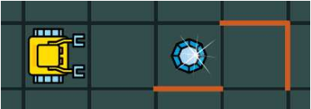
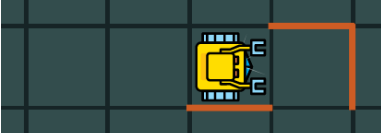
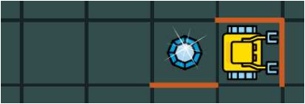
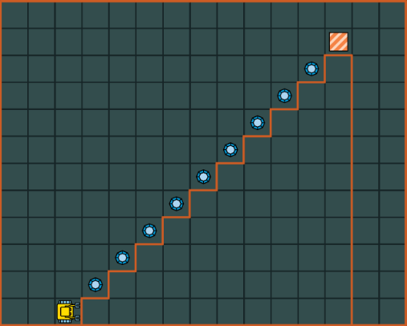

15. 递归
============

15.1 目标
----------

- 理解何谓递归,它在何时有用.
- 学习写出好的递归算法.

递归是指自己调用自己的算法.听起来怎么样?

其实,我们每天都在使用递归.比如,当我们下楼梯时,采用如下算法:

::

	Descend_staircase
	  Descend_one_step
	  If this_was_not_the_last_step
	    Descend_staircase

虽然递归不能应用于所有问题,但对于某类问题非常有用:

- 可以被分割为与原问题一模一样,只是规模更小的问题
- 同样的算法可以被用来求解更小的问题

在程序中,这意味着命令直接或通过其他命令调用它自己.

15.2 递归如何工作
------------------

考虑以下程序:

::

	def reach_wall
	  if not wall
	    go
	    reach_wall

	reach_wall

如 :ref:`Karel的初始位置<my-figure-01>` 所示:
当 ``reach_wall`` 语句第一次被执行时,机器人站在离墙3步远之外,于是 ``if not wall`` 语句通过.
接下来执行 ``go`` , 机器人的位置如 :ref:`图二<my-figure-02>` :

.. _my-figure-01:

   图1.Karel的初始位置

.. _my-figure-02:
.. figure:: _static/15_02.png
   :align: center
   :width: 40%

   图2.执行完第一步之后Karel的位置

接下来机器人又开始执行 ``go`` 后面的 ``reach_wall`` 命令.
一个比较好的理解方式是:设想在此处这个命令被它自己的命令体所替代.
相应的代码如下:

::

	if not wall
	  go
	  if not wall
	    go
	    reach_wall

由于机器人距墙还有2步,第二个 ``if not wall`` 语句通过,它又向前走一步.
新的位置如图3:

   图3.执行完第二步之后Karel的位置

接下来机器人第三次执行 ``reach_wall`` 命令.同样可以假设命令被它自己的体代码所代替.
相应代码如下:

::

	if not wall
	  go
	  if not wall
	    go
	    if not wall
	      go
	      reach_wall

由于机器人距墙还有1步,第三个 ``if not wall`` 语句通过,它又向前走了一步.
新位置如图4:

   图4.执行完第三步之后Karel的位置

现在机器人站在墙面前. 命令 ``reach_wall`` 又被执行了一次,可以想像又进行了一次代码替换:

::

	if not wall
	  go
	  if not wall
	    go
	    if not wall
	      go
	      if not wall
	        go
	        reach_wall

然而,这次条件 ``if not wall`` 不能被通过了, 这意味着程序结束了.
当然,对于这个例子使用 ``while`` 循环会更简单,但这不是本节讨论的问题.
我们会遇到很多用递归比非递归更简便的情况.

15.3 基本情形
---------------

在上例中,为了避免无限递归,使用了 ``if`` 判断语句. ``else`` 语句可以不写,表示否则什么也不做.
在递归算法中,总是需要类似 ``if`` 或 ``if-else`` 的语句,一个分支用来做递归调用,而另一个分支不做递归.
不做递归的一个分支叫做 **基本情形** .一个没有 **基本情形** 的不好的递归命令如下:

::

	def turn_forever
	  left
	  turn_forever

	turn_forever

这将导致无限递归,使得我们不得不手工终止它.

15.4 钻石楼梯
------------------

考虑如下钻石楼梯问题:

   图5.钻石楼梯

目标是爬上楼梯,拾得所有宝石,进入家方块.以下是一个递归解法:

::

	def climb_stairs
	  if not home
	    left
	    go
	    right
	    go
	    if gem
	      get
	    climb_stairs

	climb_stairs

如果一个算法既可以用递归又可以用非递归实现,可以考虑如下事实:

- 递归版本比非递归版本的慢. 因为创建新的实例并调用需要很大开销.
- 递归版本需要更多内存. 当一个递归命令被调用1000次,那么实际存在1000个实例在内存中.因此对于大次数循环不建议使用递归.

递归通常在非递归设计显得笨重时才考虑.例如,遍历树型数据结构适合用递归.还有一些排序算法也比较适合用递归.
我们会进一步讨论的.

15.5 相互递归命令
------------------

递归可以构造出有趣的形式.例如,有一对命令可以相互调用它们自己.
比如下例中的 ``odd`` 和 ``even`` 命令(同样可以解决爬楼梯问题).
注意每个递归命令中的 **基本情况** :

::

	def climb_step
	  left
	  go
	  right
	  go
	  get

	def odd
	  if not home
	    climb_step
	    even

	def even
	  if not home
	    climb_step
	    odd

	odd
